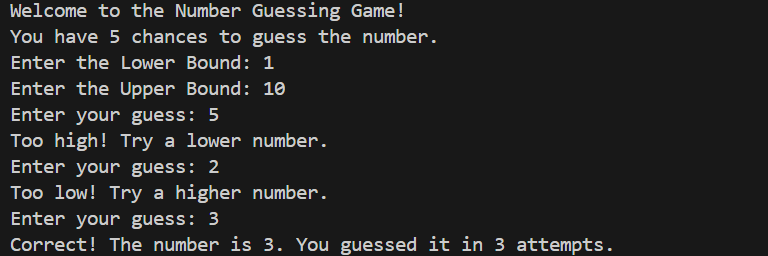
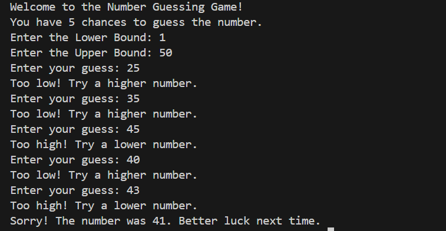

🎯 Number Guessing Game

This is a simple Python console-based game where the computer randomly selects a number within a range, and the player has to guess it within limited attempts.

🚀 Features

Player sets the lower and upper bounds of the guessing range.
Random number is generated within the chosen range.
Player has 5 chances to guess the correct number.

Helpful hints provided:

"Too high!" if the guess is above the number.
"Too low!" if the guess is below the number.
Success message when guessed correctly.
Failure message showing the correct number if attempts run out.
Replay option to play multiple rounds.

🛠️ Technologies Used

Python 3
random module for number generation

Sample Output:

